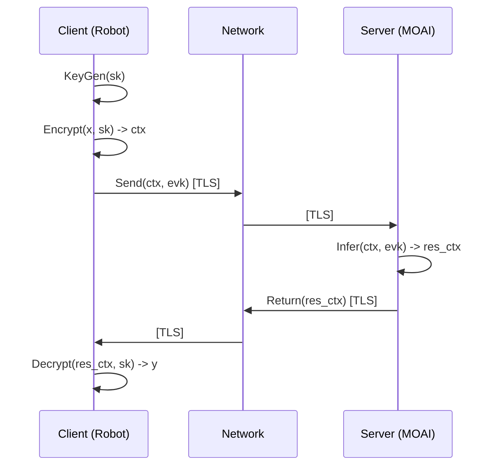

# MOAI Threat Model

**Version:** 1.1
**Date:** {DATE}

## System Description
MOAI provides FHE-based inference for robotics. Clients send encrypted data; Server computes on it without decryption; Client decrypts result.

## Trust Boundaries
1.  **Client Device (Trust Zone: HIGH)**: Holds Private Key ($sk$). Generates keys, encrypts inputs, decrypts outputs.
2.  **Network (Trust Zone: LOW)**: Public internet or local intranet. Untrusted.
3.  **MOAI Service (Trust Zone: MEDIUM)**: Performs computation. Trusted to execute code correctly, but *not* trusted with plaintext data or private keys.
4.  **RobOps Adapters (Trust Zone: MEDIUM)**: Connect to external fleets.

## Assets
*   **Customer Data (Inputs/Outputs)**: Confidential. Protected by CKKS + TLS.
*   **Model Weights**: Proprietary. Plaintext on Server (currently).
*   **Private Key ($sk$)**: CRITICAL. Sits only on Client.
*   **Evaluation Key ($evk$)**: Public (computational). Sits on Server.

## Threats & Mitigations

| ID | Threat | Mitigation | Validation |
|---|---|---|---|
| T1 | **Server Compromise**: Attacker gains root on server. | **Architecture**: Server never has $sk$. Attacker only sees ciphertexts. | **S7: Privacy Validation** (Log/Mem scan) |
| T2 | **MITM Attack**: Interception of gRPC calls. | **mTLS**: Mutual authentication + TLS 1.3 encryption. | **S7, S6**: TLS Scanning |
| T3 | **Model Theft**: Client tries to extract weights via oracle access. | **Rate Limiting**: Job queue limits requests. **FHE Noise**: Inherent noise makes extraction harder. | *Pending Analysis* |
| T4 | **DoS**: Flooding server with large ciphertexts. | **Input Validation**: Max size limits on gRPC messages. **Quotas**: Per-tenant limits. | **S2: Throughput** |
| T5 | **Malicious Driver/Kernel**: GPU driver compromises isolation. | **Containerization**: Minimal base images. **Scanning**: Regular vulnerabilities scans. | **Trivy / S7** |

## Data Flow Diagram (DFD)

